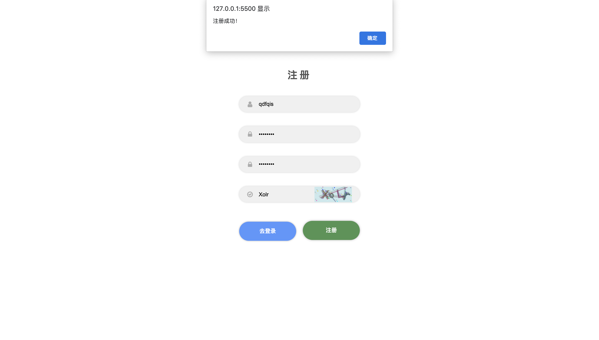
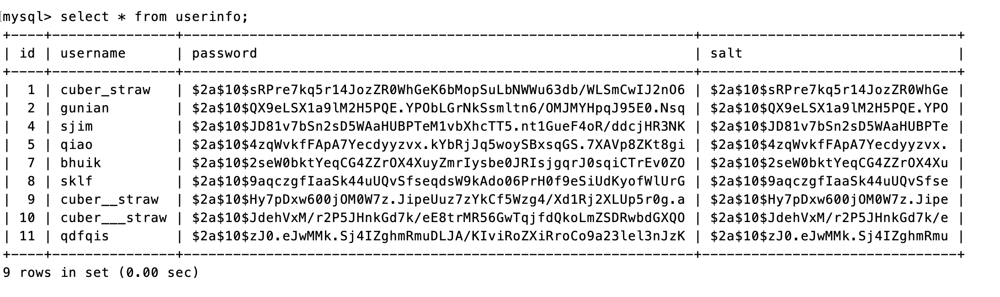

<h1 style="text-align: center; font-size: 36px; font-weight: 800; border: none">2020 WEB 前端开发第三次作业</h1>

<p style="text-align: center;">181850128 乔涤生</p>

## 运行方式

1. 修改 ./js/server.js 中的数据库配置为本地 mysql 配置

2. 安装项目需要使用的 npm 依赖

    ```
    npm install mysql
    npm install express
    npm install express-static
    npm install body-parser
    npm install bcryptjs
    npm install mysql
    ```

3. 初始化本地数据库

    mysql 运行 ./init_database.sql 文件
    
4. 启动服务端

    ```
    node ./js/server.js
    ```

5. 启动前端

    VSCode 安装 Live Server 插件，右击 my-login.html / my-signup.html ，选择 Open with Live Server


## 功能描述

1. 登录、注册时的验证码


2. 注册时，通过正则表达式实时检验用户输入信息是否合法，在所有用户输入信息无误之前，注册按钮不可用。

    




3. 密码加密

    采用 bcrypt 算法对密码加密，通过调用 bcrypt 库实现

    

4. 注册、登录成功后的页面跳转

    注册、登录成功后，通过 `location.replace()` 方法跳转到网站主页


## 关键代码

1. 使用 AJAX，将用户输入信息传输给服务端（以登录页面为例）

    ```js
    // ./js/login.js （部分）
    let username = document.getElementById('username').value
    let pwd = document.getElementById('password').value
    let url =
        'http://localhost:8080/login' + '?name=' + username + '&pwd=' + pwd
    let xhr = new XMLHttpRequest()
    xhr.onreadystatechange = function () {
        if (xhr.status === 200 && xhr.readyState === 4) {
            let json = JSON.parse(xhr.responseText)
            if (json.ok) {
                // 页面跳转
                alert('登录成功')
                location.replace('index.html')
            } else {
                alert('登录失败: ' + json.msg)
            }
        }
    }
    xhr.open('get', url, true)
    xhr.withCredentials = true
    xhr.send()
    ```

2. 注册时，通过为输入框添加 'input' 事件的响应处理函数，实时检测用户输入信息的合法性

    ```js
    // ./js/register.js
    function activeButton() {
        if (usernameValid && pwdValid && repwdValid) {
            registerButton.disabled = false
        }
    }
    // 用户名支持4-18位数字、字母、下划线
    usernameInput.addEventListener('input', function () {
        let currentName = usernameInput.value
        usernameValid = /^[\w]{4,18}$/.test(currentName)
        document.getElementById('username-warning').style.display = usernameValid ? 'none' : 'block'
        activeButton()
    })
    
    // 密码支持6-20位数字、字母、任意字符
    pwdInput.addEventListener('input', function () {
        let currentPwd = pwdInput.value
        pwdValid = /^[\W\da-zA-Z_]{6,20}$/.test(currentPwd)
        document.getElementById('pwd-warning').style.display = pwdValid ? 'none' : 'block'
        activeButton()
    })
    
    // 检查两次密码输入是否一致
    repwdInput.addEventListener('input', function () {
        let currentRepwd = repwdInput.value
        repwdValid = currentRepwd === pwdInput.value
        document.getElementById('repwd-warning').style.display = repwdValid ? 'none' : 'block'
        activeButton()
    })
    ```

3. 服务端对前端传输数据的处理（以注册为例）

    ```js
    // ./js/server.js
    server.use('/reg', function (req, res) {
        let POST = req.body
        let test = select(POST.name)
        let user
        test.then(function (data) {
            user = data
            if (user === undefined) {
                // 加密密码
                const salt = bcrptyjs.genSaltSync(10)
                const password = bcrptyjs.hashSync(POST.pwd, salt)
                let arr = []
                arr.push(POST.name)
                arr.push(password)
                arr.push(salt)
                insert(arr)
                res.send({ ok: true, msg: '注册成功' })
            } else {
                res.send({ ok: false, msg: '用户名已存在' })
            }
        })
    })
    
    ```

4. 本地数据库的初始化

    ```sql
    DROP DATABASE IF EXISTS User;
    CREATE DATABASE User;
    USE User;
    CREATE TABLE IF NOT EXISTS UserInfo(
        id INT UNSIGNED  AUTO_INCREMENT PRIMARY KEY ,
        username VARCHAR(32) NOT  NULL , -- 用户名
        password VARCHAR(96) NOT NULL ,  -- 加密后的密码
        salt VARCHAR(96) NOT NULL        -- 盐
    )ENGINE=InnoDB DEFAULT CHARSET=UTF8;
    ```

